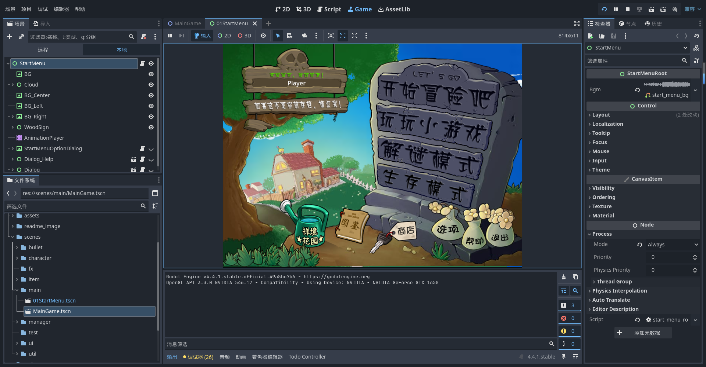

# PVZ of OW

> 使用 Godot 4.6 制作的《植物大战僵尸》复刻与同人改版工程，包含原版玩法复刻、PVZ × Overwatch 同人内容、自定义关卡工具和较完整的扩展框架。

[项目演示视频](https://www.bilibili.com/video/BV1FKNJzUEpp/) · [开发文档](./docs/开发相关.md) · [项目结构图](./docs/AGENT_PROJECT_MAP.md) · [AI 任务手册](./docs/AGENT_TASK_RECIPES.md) · [参与贡献](./CONTRIBUTING.md) · [许可协议](./LICENSE)


## 项目状态

- 引擎：Godot 4.6 系列，GL Compatibility 渲染模式
- 目标分辨率：1066 × 600（默认窗口 1600 × 900）
- 当前内容：除僵王和部分小游戏外，已实现大部分原版玩法，并持续加入同人角色、数值编辑器和关卡工坊等内容
- 主要语言：GDScript、Godot Scene/Resource
- 项目性质：非官方、非商业的学习与同人项目

> [!IMPORTANT]
> GitHub 仓库不是“下载后即可完整运行”的游戏发行包。出于版权原因，仓库不包含完整的原版图片、字体、音乐和音效；工程中仍有大量 `res://assets/` 引用。只 clone 仓库可以阅读代码、交给 AI 分析并参与不依赖素材的开发，但要在 Godot 中完整运行，必须由使用者自行准备拥有合法使用权的素材，并保持项目预期的目录和文件名。

为避免侵权，美术、音乐、音效和字体等资源未在本 GitHub 仓库中保留。如需获取项目相关说明及网盘链接，请在 Bilibili 搜索 **“瓦尔泽亚1582”**。下载和使用相关资源前，请自行确认你所在地区的法律要求以及相应资源的授权范围；项目代码许可证不涵盖这些资源。

## 功能概览

- PVZ 经典前院、夜晚、泳池、迷雾和屋顶地形
- 植物、僵尸、子弹、卡牌、掉落物和状态组件系统
- 冒险、小游戏、生存、解谜及自定义关卡资源
- 游戏内关卡工坊与独立网页关卡设计器
- 图鉴、花园、商店、存档和用户数据流程
- 多个可直接启动的地形调试场景
- PVZ × Overwatch 同人植物、僵尸与玩法扩展
- 面向维护者与 AI coding agent 的项目地图和任务配方

## 快速开始

### 1. 准备环境

- [Godot Engine](https://godotengine.org/) 4.6.x
- Git
- 推荐：支持 GDScript 的编辑器；搜索代码时使用 [ripgrep](https://github.com/BurntSushi/ripgrep)

项目当前启用了多个编辑器插件。第一次导入时请等待 Godot 完成资源扫描，不要提交自动生成的 `.godot/` 目录。

### 2. 克隆源码

```bash
git clone https://github.com/walle1911/pvz-of-ow.git
cd pvz-of-ow
```

如果你的目标是阅读源码、让 AI 理解架构或修改纯逻辑，到这里就可以开始。让 AI 先读取 [`AGENTS.md`](./AGENTS.md)，不要让它按常见 PVZ/Godot 项目结构猜路径。

### 3. 准备本地素材（完整运行必需）

将你有权使用的素材放入仓库根目录下的 `assets/`，并保持场景和脚本引用的相对路径不变，例如：

```text
assets/
├── audio/
├── fonts/
├── image/
└── reanim/
```

`assets/` 默认被 Git 忽略，避免本地版权素材被意外提交。若缺少素材，Godot 会报告 `Preload file ... does not exist`、`Failed loading resource` 或依赖脚本解析失败；这不是重新导入 `.godot/` 缓存可以解决的问题。

美术、音乐等资源为避免侵权未随 GitHub 仓库提供。请在 Bilibili 搜索 **“瓦尔泽亚1582”** 获取项目说明和网盘链接，并在使用前自行确认相关资源的授权与合规性。

### 4. 导入 Godot

1. 打开 Godot Project Manager。
2. 选择 **Import**，定位仓库根目录的 `project.godot`。
3. 确认使用 Godot 4.6.x 打开。
4. 等待首次导入完成后运行主场景。

主入口由 `project.godot` 的 `run/main_scene` 指定。主游戏基础场景为 `scenes/main/MainGame00Base.tscn`。

### 5. 验证环境

在 macOS 且 Godot 安装于默认路径时：

```bash
git diff --check
env HOME=/tmp /Applications/Godot.app/Contents/MacOS/Godot \
  --headless --path "$(pwd)" --quit
```

其他平台可将 Godot 可执行文件替换为本机路径：

```bash
godot --headless --path . --quit
```

退出码为 0 仍不一定代表素材完整；请同时检查输出中是否存在 `SCRIPT ERROR`、`Parse Error` 和缺失的 `res://assets/` 文件。

## 让 AI 在几分钟内接手

仓库已经包含 AI/agent 所需的上下文文件。推荐按以下顺序加载：

1. [`AGENTS.md`](./AGENTS.md)：全仓规则、禁止操作、验证要求和关键路径
2. [`README.md`](./README.md)：项目定位、环境与版权边界
3. [`docs/AGENT_PROJECT_MAP.md`](./docs/AGENT_PROJECT_MAP.md)：系统地图和权威入口
4. [`docs/AGENT_TASK_RECIPES.md`](./docs/AGENT_TASK_RECIPES.md)：新增角色、卡牌等常见任务的完整清单
5. 任务相关专项文档，例如 [`docs/开发相关.md`](./docs/开发相关.md)、[`docs/子弹说明文档.md`](./docs/子弹说明文档.md) 或 [`docs/关卡工坊.md`](./docs/关卡工坊.md)

可以把下面这段直接交给 Codex、Claude Code、Cursor 或其他 coding agent：

```text
你正在维护一个 Godot 4.6 项目。开始前完整阅读 AGENTS.md、README.md、
docs/AGENT_PROJECT_MAP.md 和 docs/AGENT_TASK_RECIPES.md，再阅读与任务相关的专项文档。
先执行 git status --short，保留已有改动；使用 rg 确认真实路径和相邻实现，
不要按惯例猜目录。对 .tscn/.tres 做最小修改，保留 uid、节点路径和导出值。
完成后先运行 git diff --check，再进行与改动范围相称的 Godot headless 验证。
缺失 assets/ 可能是仓库的已知版权边界，不要虚构、下载或提交受版权保护的素材。
```

给 AI 分配任务时，最好同时提供：目标表现、涉及的角色/关卡、复现步骤、截图或视频、验收标准，以及是否允许修改场景和资源文件。

## 项目结构

| 路径 | 用途 |
| --- | --- |
| `project.godot` | Godot 项目入口、自动加载和插件配置 |
| `scripts/` | GDScript；包含 autoload、manager、角色、子弹和 UI 逻辑 |
| `scenes/` | 主游戏、角色、子弹、UI、花园等场景 |
| `resources/` | 关卡、种植条件、对话和角色状态等自定义资源 |
| `animation/` | Godot 动画资源 |
| `data/` | 图鉴、主题和关卡 JSON 数据 |
| `addons/` | Godot 编辑器插件和项目工具 |
| `tests/` | 运行时、编辑器和玩法 smoke tests |
| `tools/level_designer/` | 独立网页关卡设计器 |
| `level_game_para/` | 自定义关卡参数文件 |
| `docs/` | 开发说明、系统地图和任务手册 |
| `assets/` | 本地图片、字体和音频；GitHub 不提供完整目录 |

更详细的系统关系和关键文件请看 [`docs/AGENT_PROJECT_MAP.md`](./docs/AGENT_PROJECT_MAP.md)。

## 常用开发入口

| 目标 | 首要入口 |
| --- | --- |
| 主游戏节点树 | `scenes/main/MainGame00Base.tscn` |
| 主游戏管理器 | `scripts/manager/main_game_manager.gd` |
| 角色注册 | `scripts/autoload/global/character_registry.gd` |
| 当前解锁/选择状态 | `scripts/autoload/global/global_game_state.gd` |
| 植物/僵尸脚本 | `scripts/character/plant/`、`scripts/character/zombie/` |
| 角色组件 | `scripts/character/components/` |
| 子弹注册与实现 | `scripts/autoload/global/bullet_registry.gd`、`scripts/bullet/` |
| 卡牌预览权威场景 | `scenes/autoload/all_cards.tscn` |
| 关卡资源 | `resources/level_date_resource/` |
| 图鉴数据 | `data/almanac_data.json` |

调试不同地形可使用：

- `scenes/main/MainGameDebug9999Sun.tscn`
- `scenes/main/MainGameDebug9999Night.tscn`
- `scenes/main/MainGameDebug9999Pool.tscn`
- `scenes/main/MainGameDebug9999Fog.tscn`
- `scenes/main/MainGameDebug9999Roof.tscn`

## 自定义关卡

自定义关卡使用 `level_game_para/` 下的参数文件。核心类型为 `ResourceLevelData`，定义见：

```text
res://scripts/resources/level/level_data.gd
```

游戏内关卡工坊的使用与维护说明见 [`docs/关卡工坊.md`](./docs/关卡工坊.md)。独立网页工具见 [`tools/level_designer/README.md`](./tools/level_designer/README.md)。

## 参与贡献

完整流程见 [`CONTRIBUTING.md`](./CONTRIBUTING.md)。提交代码前请特别注意：

- 不要提交未经授权的 PVZ/Overwatch 素材、用户存档、`.godot/` 缓存或本地导出包。
- 沿用相邻角色、组件、场景和资源的现有模式，避免无关重排。
- 提交前运行 `git diff --check`、相关测试和 Godot headless 校验。
- Pull Request 中写清复现方式、修改范围、验证结果；视觉改动请附截图或短视频。

所有需要用户决策的 UI 弹窗都必须在目标分辨率内始终显示明确的确认和取消/关闭按钮。可滚动内容只能占中间区域，操作按钮必须位于固定底栏。

## 已知限制

- GitHub 源码仓库缺少完整 `assets/`，干净 clone 不能直接完整运行。
- 僵王和部分小游戏仍未完成。
- 一些编辑器插件可能只在特定 Godot 版本、语言或操作系统下正常工作。
- `R2Ga_PVZ` 中包含 Windows 转换工具，非 Windows 用户可不使用该插件。
- 项目仍在快速迭代，场景 UID、存档兼容映射和数据格式需要谨慎维护。

## 插件与参考工具

- [anim_player_refactor](https://github.com/poohcom1/godot-animation-player-refactor)：AnimationPlayer 动画重构插件。若编辑器为中文，插件内查找 `Animation` 菜单的逻辑可能需要同时兼容“动画”。
- [R2Ga_PVZ](https://github.com/hsk-dream/PVZ_reanim2godot_animation)：将 PVZ reanim 动画转换为 Godot 动画资源；fork 自 [PVZ_reanim2godot_animation](https://github.com/HYTommm/PVZ_reanim2godot_animation)。
- [PVZ Wiki](https://wiki.pvz1.com/doku.php?id=home)
- [Godot 4.3 PVZ 制作教程](https://www.bilibili.com/video/BV1AdBtY9Ec5/)
- [PVZ PAK 解包教程](https://www.bilibili.com/video/BV1JQ4y1k7KS/)

发布或再分发仓库前，请逐项核对 `addons/` 内第三方插件的原始许可证和署名要求；项目主许可证不会自动覆盖第三方代码、字体、可执行文件或素材。

## 许可与版权声明

本仓库代码使用 [`LICENSE`](./LICENSE) 中的 **Custom Non-Commercial License v1.0**。它允许非商业学习、研究和同人创作，但禁止商业用途。

这是一份自定义的“源码可用”许可证，通常不被视为 OSI 定义下的标准开源许可证。如果你需要在标准开源生态中复用、打包或分发本项目，请先确认许可证是否满足你的使用场景。

《植物大战僵尸》及相关名称、角色、图像、音乐和其他内容的权利归 PopCap Games / Electronic Arts 及各自权利人所有。《守望先锋》及相关内容的权利归 Blizzard Entertainment 及各自权利人所有。本项目与上述公司无隶属、赞助或官方认可关系。

本项目仅供学习、研究和非商业同人创作，不附带任何担保。代码许可证不授予任何第三方商标、角色、美术、字体、音乐或音效的使用权。

安全漏洞或可能泄露隐私的信息请不要直接发布到公开 Issue，报告方式见 [`SECURITY.md`](./SECURITY.md)。

## 展示与交流

- Bilibili：[开源！使用 Godot 实现对原版 PVZ 的复刻](https://www.bilibili.com/video/BV1FKNJzUEpp/)
- QQ 群：1046565016



## 致谢

- 致敬《植物大战僵尸》原作团队（PopCap / EA）
- 植物图鉴初稿整理：[多003_](https://space.bilibili.com/472181151)
- 部分 16:9 宽屏素材使用 [豆包 AI](https://www.doubao.com/chat) 辅助生成
- 樱桃炸弹爆炸粒子参考 [HYTommm / Godot-PVZ](https://github.com/HYTommm/Godot-PVZ)
- 信号总线、随机选择器参考 [LiGameAcademy / godot_core_system](https://github.com/LiGameAcademy/godot_core_system)
- 种子雨雨幕参考 [Godot 雨雾教程](https://www.bilibili.com/video/BV15ibAz4EZi)

感谢所有测试、反馈、文档和代码贡献者。
