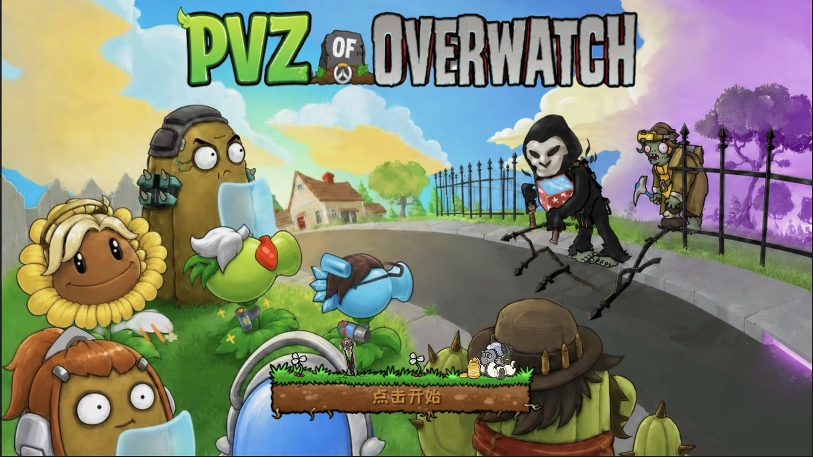

# PVZ-OF-OW



PVZ-OF-OW 是一款基于 Godot 4.6 开发的非商业同人塔防游戏。项目以《植物大战僵尸》的核心玩法为基础，引入《守望先锋》主题角色、技能机制与关卡设计，并提供面向内容创作的关卡工坊和数值调整功能。

> 项目处于持续开发阶段，现有内容、数据格式与功能实现可能随版本更新而调整。

## 功能特性

- 支持冒险、小游戏、解谜、生存及自定义关卡等游戏模式
- 包含白天、夜晚、泳池、迷雾和屋顶等战场环境
- 实现植物、僵尸、卡牌、子弹、掉落物和状态效果等基础系统
- 加入 PVZ × Overwatch 同人角色及专属玩法机制
- 提供图鉴、花园、商店和多玩家存档等外围系统
- 内置关卡工坊，可配置出战阵容、僵尸波次与关卡参数
- 内置数值调整工具，可修改已开放的植物和僵尸参数

## 技术信息

| 项目 | 配置 |
| --- | --- |
| 游戏引擎 | Godot 4.6.x |
| 脚本语言 | GDScript |
| 渲染模式 | GL Compatibility |
| 设计分辨率 | 1066 × 600 |
| 默认启动场景 | `scenes/main/00TitleLoadingScreen.tscn` |

## 获取与运行

### 环境要求

- Godot Engine 4.6.x
- 支持 GL Compatibility 渲染模式的图形环境

### 启动步骤

1. 获取本仓库源码。
2. 在 Godot Project Manager 中导入仓库根目录下的 `project.godot`。
3. 等待 Godot 完成首次资源扫描与导入。
4. 运行项目。

也可以在仓库根目录通过命令行启动编辑器：

```bash
godot --editor --path .
```

### 素材说明

本仓库不包含完整的第三方图片、字体、音乐和音效。项目中的部分场景仍会引用 `assets/` 目录；缺少对应资源时，Godot 可能报告资源加载失败，项目也无法完整运行。

使用者需要自行准备具有合法使用权的资源，并保持项目引用所要求的目录结构与文件名。仓库代码的许可不代表对任何第三方素材的授权。

## 开发者工具

游戏内开发者模式用于制作、调整和验证游戏内容，当前主要提供以下能力：

- 新建、载入和编辑自定义关卡
- 配置植物卡池、僵尸阵容与出怪波次
- 修改关卡环境及全局参数
- 调整已开放的植物和僵尸数值
- 试玩当前配置并返回工坊继续编辑
- 导入和导出开发者包

相关说明：

- [关卡工坊](./docs/关卡工坊.md)
- [数值调整](./docs/数值调整.md)
- [开发说明](./docs/开发相关.md)
- [玩家存档位置](./docs/玩家存档位置.md)

## 项目结构

| 路径 | 内容 |
| --- | --- |
| `addons/` | Godot 编辑器扩展 |
| `animation/` | 动画资源 |
| `data/` | 游戏数据与内置关卡模板 |
| `resources/` | Godot Resource 配置 |
| `scenes/` | 游戏场景 |
| `scripts/` | GDScript 源码 |
| `tests/` | 测试场景与测试脚本 |
| `tools/` | 独立开发工具 |
| `project.godot` | 项目配置与入口 |

## 开发状态

项目已建立主要玩法系统以及多个游戏模式的基础框架。目前仍在持续补充关卡内容、完善小游戏、解谜和生存模式，并对操作体验、数值平衡与兼容性进行调整。

## 致谢

- 感谢 **无敌霹雳大战锤** 提供美术素材与创意支持。
- 感谢 **睡觉做大梦_zzz** 开源 Godot 版《植物大战僵尸》的原始素材。
- 感谢所有参与测试并提供问题反馈与改进建议的玩家。

## 联系方式

- Bilibili：[开发者主页](https://space.bilibili.com/177278424)
- Email：[2818055713@qq.com](mailto:2818055713@qq.com)

## 许可与版权

项目代码采用 [Custom Non-Commercial License v1.0](./LICENSE)，仅允许在许可证约定范围内用于非商业学习、研究、教育及同人创作。项目按现状提供，不附带任何形式的担保。

《植物大战僵尸》相关名称、角色及内容的权利归 PopCap Games、Electronic Arts 及相应权利人所有。《守望先锋》相关名称、角色及内容的权利归 Blizzard Entertainment 及相应权利人所有。本项目为非官方同人作品，与上述公司不存在隶属、赞助或官方认可关系。

项目许可证不授予第三方商标、角色、美术、字体、音乐、音效及其他受保护内容的使用权。
